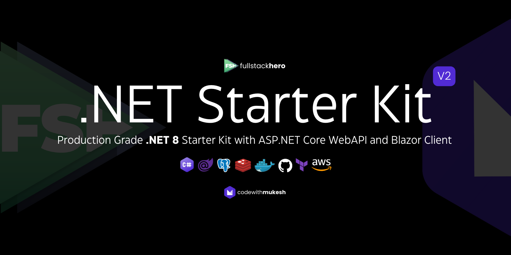
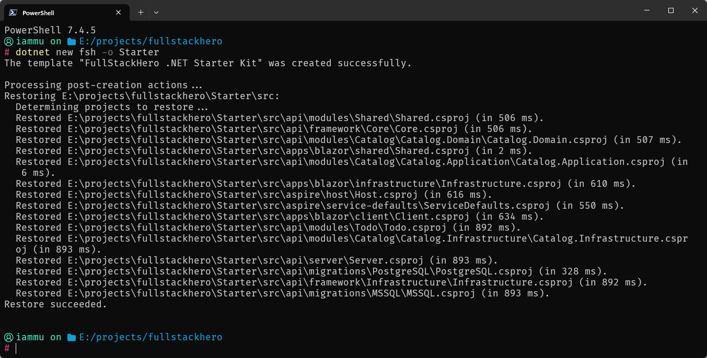

import { Steps } from '@astrojs/starlight/components';

FullStackHero .NET Starter Kit is a starting point for your next `.NET 8 Clean Architecture` solution that incorporates the most essential packages and features your projects will ever need including out-of-the-box Multi-Tenancy support. This project can save well over 200+ hours of development time for your team.



# Important

[Follow @iammukeshm on X](https://x.com/iammukeshm) for project related updates.

# Quick Start Guide

## Prerequisites

Make sure that you have the following configured / setup on your development machine.

- .NET 8 SDK installed.
- Visual Studio IDE.
- Docker Desktop. (required only if you need the Aspire Dashboard running.)
- PostgreSQL instance running on your machine or docker container.

## Option #1 - FSH .NET Template

FullStackHero .NET StarterKit is built to have seamless & developer friendly experience. To build your new .NET project based on this template, the recommended way is to install the .NET template package on your machine.

<Steps>
1. Install the template by running the following command.

    ```
    dotnet new install FullStackHero.NET.StarterKit::2.0.2-rc
    ```
</Steps>

## Option #2 - Fork!

Please follow the below instructions.

1. Fork this repository to your local.
2. Open up the `./src/FSH.Starter.sln`.
3. This would up the FSH Starter solution which has 3 main components.
   1. Aspire Dashboard (set as the default project)
   2. Web API
   3. Blazor
4. Now we will have to set the connection string for the API. Navigate to `./src/api/server/appsettings.Development.json` and change the `ConnectionString` under `DatabaseOptions`. Save it.
5. Once that is done, run the application via Visual Studio, with Aspire as the default project. This will open up Aspire Dashboard at `https://localhost:7200/`.
6. API will be running at `https://localhost:7000/swagger/index.html`.
7. Blazor will be running at `https://localhost:7100/`.

## Your First .NET Starter Kit Solution!

<Steps>
1. Generate your brand new Solution!

    ```
    dotnet new fsh -o Starter
    ```

    Here, your new solution name would be `Starter`

2. Here is the solution generation. This also ensures that all the required packages are resolved for you.

    
</Steps>

# 🚀 FullStackHero .NET 8 Starter Kit Goals

> With Aspire Dashboard, ASP.NET Core Web API & Blazor Client

# ✨ Technologies

- ASP.NET Core 8
- Entity Framework Core 8
- Blazor
- MediatR
- PostgreSQL
- Redis
- FluentValidation

## 👨‍🚀 Architecture

## 📬 Service Endpoints

> todo : can someone update this? Simple run the API and add the route details referring to Swagger.

| Endpoint | Method | Description      |
| -------- | ------ | ---------------- |
| `/token` | POST   | Generates Token. |

# 🧪 Running Locally

# 🐳 Docker Support

# ☁️ Deploying to AWS

# 🤝 Contributing

# 📝 Notes

## Add Migrations

Navigate to `./api/server` and run the following EF CLI commands.

```bash
dotnet ef migrations add "Add Identity Schema" --project .././migrations/postgresql/ --context IdentityDbContext -o Identity
dotnet ef migrations add "Add Tenant Schema" --project .././migrations/postgresql/ --context TenantDbContext -o Tenant
dotnet ef migrations add "Add Todo Schema" --project .././migrations/postgresql/ --context TodoDbContext -o Todo
dotnet ef migrations add "Add Catalog Schema" --project .././migrations/postgresql/ --context CatalogDbContext -o Catalog
```

# ⚖️ LICENSE

MIT © [fullstackhero](LICENSE)
